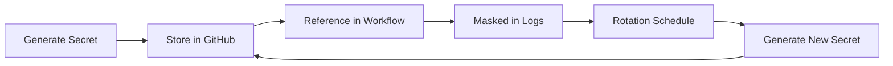

# GitHub Secrets Configuration Guide

> **Security Note**: Never commit secrets to the repository. All sensitive
> values must be configured in GitHub repository settings.

## 📋 Required Secrets

### Database & Authentication

| Secret                | Description                  | Source                    | Required |
| --------------------- | ---------------------------- | ------------------------- | -------- |
| `DATABASE_URL`        | PostgreSQL connection string | Your database host        | ✅ Yes   |
| `NEXTAUTH_SECRET`     | NextAuth encryption key      | `openssl rand -base64 32` | ✅ Yes   |
| `NEXTAUTH_URL`        | NextAuth callback URL        | `https://yourdomain.com`  | ✅ Yes   |
| `AUTH_URL`            | Alternative auth URL         | Same as NEXTAUTH_URL      | ✅ Yes   |
| `NEXT_PUBLIC_APP_URL` | Public app URL (non-secret)  | `https://yourdomain.com`  | ✅ Yes   |

### OAuth Providers (Optional)

| Secret          | Description                | Source                    |
| --------------- | -------------------------- | ------------------------- |
| `GITHUB_ID`     | GitHub OAuth client ID     | GitHub Developer Settings |
| `GITHUB_SECRET` | GitHub OAuth client secret | GitHub Developer Settings |
| `GOOGLE_ID`     | Google OAuth client ID     | Google Cloud Console      |
| `GOOGLE_SECRET` | Google OAuth client secret | Google Cloud Console      |

### Email Service

| Secret                  | Description          | Source         |
| ----------------------- | -------------------- | -------------- |
| `EMAIL_SERVER_HOST`     | SMTP server hostname | Email provider |
| `EMAIL_SERVER_PORT`     | SMTP server port     | Email provider |
| `EMAIL_SERVER_USER`     | SMTP username        | Email provider |
| `EMAIL_SERVER_PASSWORD` | SMTP password        | Email provider |
| `EMAIL_FROM`            | Sender email address | Your domain    |

### Image Upload

| Secret                  | Description           | Source               |
| ----------------------- | --------------------- | -------------------- |
| `CLOUDINARY_CLOUD_NAME` | Cloudinary cloud name | Cloudinary Dashboard |
| `CLOUDINARY_API_KEY`    | Cloudinary API key    | Cloudinary Dashboard |
| `CLOUDINARY_API_SECRET` | Cloudinary API secret | Cloudinary Dashboard |
| `IMAGEKIT_PUBLIC_KEY`   | ImageKit public key   | ImageKit Dashboard   |
| `IMAGEKIT_PRIVATE_KEY`  | ImageKit private key  | ImageKit Dashboard   |

### Cache & Queue

| Secret                     | Description         | Source          |
| -------------------------- | ------------------- | --------------- |
| `UPSTASH_REDIS_REST_URL`   | Upstash Redis URL   | Upstash Console |
| `UPSTASH_REDIS_REST_TOKEN` | Upstash Redis token | Upstash Console |
| `UPSTASH_QSTASH_TOKEN`     | QStash API token    | Upstash Console |

### Deployment

| Secret              | Description              | Source                      |
| ------------------- | ------------------------ | --------------------------- |
| `VERCEL_TOKEN`      | Vercel API token         | Vercel Settings             |
| `VERCEL_ORG_ID`     | Vercel organization ID   | Vercel Team Settings        |
| `VERCEL_PROJECT_ID` | Vercel project ID        | `vercel.json`               |
| `DOCKER_REGISTRY`   | Docker registry URL      | Docker Hub/Private Registry |
| `DOCKER_USERNAME`   | Docker registry username | Your account                |
| `DOCKER_PASSWORD`   | Docker registry password | Your account                |
| `DEPLOY_HOST`       | SSH deployment host      | Your server                 |
| `DEPLOY_USER`       | SSH deployment user      | Your server                 |
| `DEPLOY_KEY`        | SSH private key          | Generate with `ssh-keygen`  |

---

## 🔐 How to Add Secrets to GitHub

### Via GitHub Web UI

1. Go to your repository → **Settings** → **Secrets and variables** →
   **Actions**
2. Click **New repository secret**
3. Enter the secret name and value
4. Click **Add secret**

### Via GitHub CLI

```bash
# Install GitHub CLI if not already installed
# https://cli.github.com

# Add a secret
gh secret set SECRET_NAME --body "secret_value" --repo owner/repo

# List all secrets
gh secret list --repo owner/repo

# Delete a secret
gh secret delete SECRET_NAME --repo owner/repo
```

### Via Terraform (IaC)

```hcl
resource "github_actions_secret" "database_url" {
  repository  = "comicwise"
  secret_name = "DATABASE_URL"
  plaintext_value = var.database_url
}
```

---

## 🛡️ Secret Security Best Practices

### ✅ Do's

- ✅ Rotate secrets regularly (quarterly recommended)
- ✅ Use strong, randomly generated passwords
- ✅ Keep separate secrets for staging and production
- ✅ Grant secrets only to needed workflows
- ✅ Use environment-specific secret prefixes (e.g., `PROD_`, `STAGING_`)
- ✅ Log secret access for audit trails
- ✅ Review secret permissions monthly

### ❌ Don'ts

- ❌ Never commit secrets to version control
- ❌ Never hardcode secrets in code/config files
- ❌ Never share secrets via email or chat
- ❌ Never log secrets in CI/CD output
- ❌ Never use weak or predictable secrets
- ❌ Never disable secret masking in logs

---

## 🔄 Rotating Secrets

### When to Rotate

- After suspected compromise
- Quarterly (recommended schedule)
- When employee leaves organization
- After changing services/providers

### Rotation Process

1. Generate new secret value
2. Update in GitHub Secrets
3. Verify deployments work
4. Update local `.env.local` if needed
5. Document rotation date
6. Archive old secret securely

---

## 🚨 Detecting Exposed Secrets

### If a secret is exposed:

1. **Immediately revoke** the exposed secret in the original service
2. **Generate a new secret** with high entropy
3. **Update GitHub secret** with new value
4. **Redeploy** all affected services
5. **Audit logs** for unauthorized access
6. **Document incident** for compliance

### Tools to detect exposed secrets:

- [TruffleHog](https://github.com/trufflesecurity/trufflehog) - Scans repo
  history
- [GitGuardian](https://gitguardian.com/) - Real-time secret detection
- [GitHub Secret Scanning](https://docs.github.com/en/code-security/secret-scanning) -
  Built-in scanning

---

## 📝 Secret Management Workflow



---

## 🔍 Verifying Secrets in Workflows

### Check if secret is available:

```yaml
- name: Verify secret exists
  run: |
    if [ -z "${{ secrets.DATABASE_URL }}" ]; then
      echo "❌ DATABASE_URL secret not configured"
      exit 1
    fi
    echo "✅ DATABASE_URL is configured"
```

### Safe secret logging:

```yaml
- name: Safe logging
  run: |
    # ✅ Good - secret is masked
    echo "Database: ${{ secrets.DATABASE_URL }}"

    # ❌ Bad - might leak secret
    echo "Connecting to: ${{ secrets.DATABASE_URL }}" | tee debug.log
```

---

## 🌍 Environment-Specific Secrets

### Production Secrets

```yaml
environment: production
secrets:
  DATABASE_URL: ${{ secrets.PROD_DATABASE_URL }}
  NEXTAUTH_SECRET: ${{ secrets.PROD_NEXTAUTH_SECRET }}
```

### Staging Secrets

```yaml
environment: staging
secrets:
  DATABASE_URL: ${{ secrets.STAGING_DATABASE_URL }}
  NEXTAUTH_SECRET: ${{ secrets.STAGING_NEXTAUTH_SECRET }}
```

---

## 📚 Additional Resources

- [GitHub Secrets Documentation](https://docs.github.com/en/actions/security-guides/using-secrets-in-github-actions)
- [OWASP Secrets Management](https://owasp.org/www-community/Sensitive_Data_Exposure)
- [Vault by HashiCorp](https://www.vaultproject.io/) - Enterprise secret
  management
- [AWS Secrets Manager](https://aws.amazon.com/secrets-manager/) - AWS secret
  storage

---

## ✅ Checklist: Before First Deployment

- [ ] All required secrets added to GitHub
- [ ] Secrets tested locally with `.env.local`
- [ ] CI pipeline validates secret access
- [ ] No secrets logged in workflow output
- [ ] Environment-specific secrets configured
- [ ] Secret rotation schedule established
- [ ] Team trained on secret security
- [ ] Backup/recovery process documented

---

**Last Updated**: 2025-12-13  
**Maintained by**: ComicWise DevOps Team
